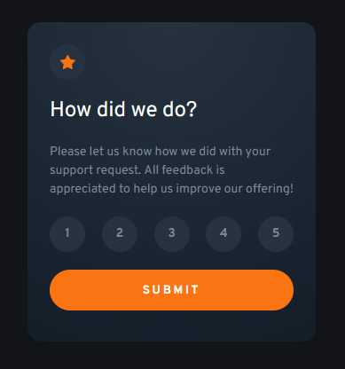

# Frontend Mentor - Interactive rating component solution

This is a solution to the [Interactive rating component challenge on Frontend Mentor](https://www.frontendmentor.io/challenges/interactive-rating-component-koxpeBUmI).

## Overview

### The challenge

Users should be able to:

- View the optimal layout for the app depending on their device's screen size
- See hover states for all interactive elements on the page
- Select and submit a number rating
- See the "Thank you" card state after submitting a rating

### Screenshot

### Links

- Solution URL: [Github](https://github.com/jeremylloyd/frontend-mentor-interactive-rating-component)
- Live Site URL: [Github Pages](https://jeremylloyd.github.io/frontend-mentor-interactive-rating-component/)

## My process

### Built with

- HTML
- CSS
- Vanilla JS

### What I learned

